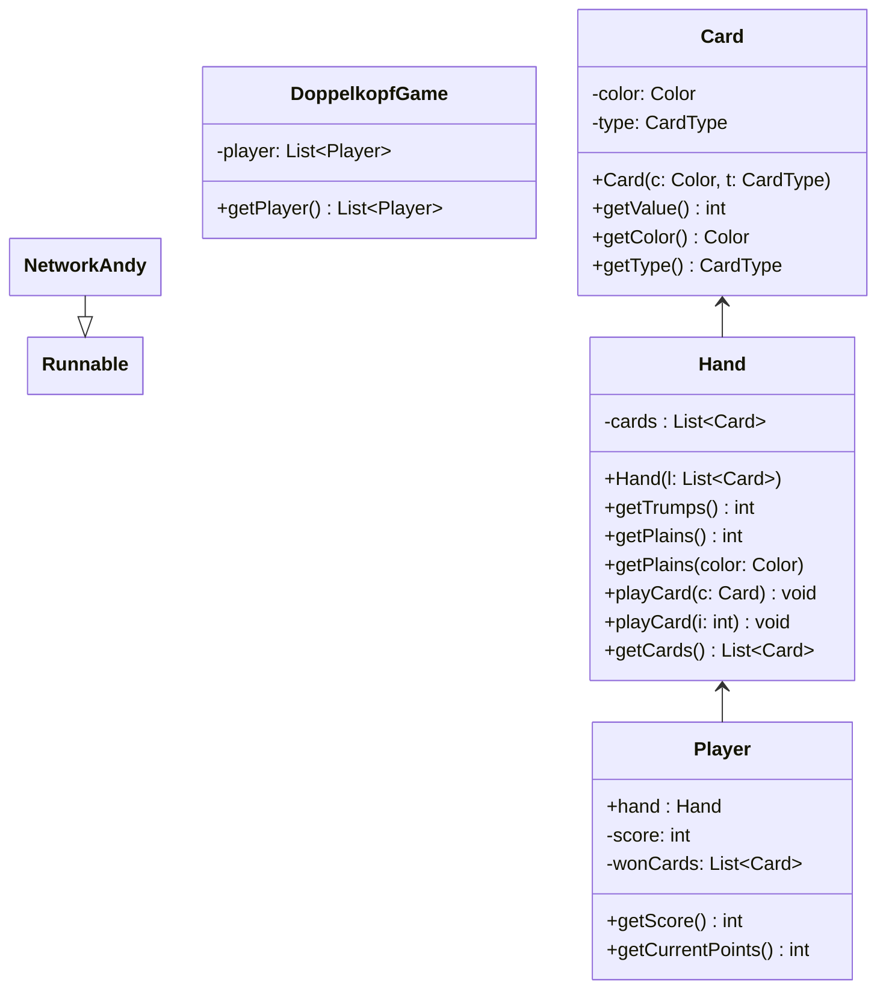

```mermaid
---
config:
  layout: elk
  class:
    hideEmptyMembersBox: true
---

classDiagram
direction TB
    class NetworkAndy{
    }
    class Runnable
    NetworkAndy --|> Runnable

    class DoppelkopfGame {
      -player: List~Player~

      +getPlayer() List~Player~
    }

    class Player {
	    +hand : Hand
	    -score: int
        -wonCards: List~Card~

        +getScore() int
        +getCurrentPoints() int
    }
    class Hand {
	    -cards : List~Card~
	    +Hand(l: List~Card~)
	    +getTrumps() int
	    +getPlains() int
      +getPlains(color: Color)
	    +playCard(c: Card) void
	    +playCard(i: int) void
	    +getCards() List~Card~
    }
    class Card {
	    -color: Color
	    -type: CardType
	    +Card(c: Color,  t: CardType)
	    +getValue() int
	    +getColor() Color
	    +getType() CardType
    }
    Card <-- Hand
    Hand <-- Player

```