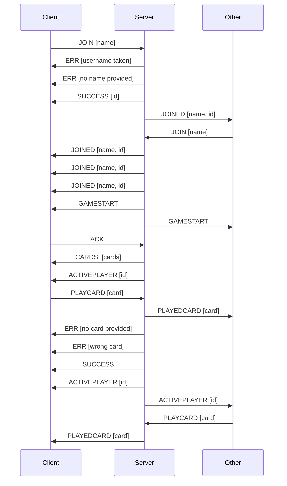

```mermaid
sequenceDiagram
    participant Client
    participant Server
    participant Other
    Client->>Server: JOIN [name]
    Server->>Client: ERR [username taken]
    Server->>Client: ERR [no name provided]
    Server->>Client: SUCCESS [id]
    Server->>Other: JOINED [name, id]
    Other->>Server: JOIN [name]
    Server->>Client: JOINED [name, id]
    Server->>Client: JOINED [name, id]
    Server->>Client: JOINED [name, id]
    Server->>Client: GAMESTART
    Server->>Other: GAMESTART
    Client->>Server: ACK
    Server->>Client: CARDS: [cards] 
    Server->>Client: ACTIVEPLAYER [id]
    Client->>Server: PLAYCARD [card]
    Server->>Other: PLAYEDCARD [card]
    Server->>Client: ERR [no card provided]
    Server->>Client: ERR [wrong card]
    Server->>Client: SUCCESS 
    Server->>Client: ACTIVEPLAYER [id]
    Server->>Other: ACTIVEPLAYER [id]
    Other->>Server: PLAYCARD [card]
    Server->>Client: PLAYEDCARD [card]
```